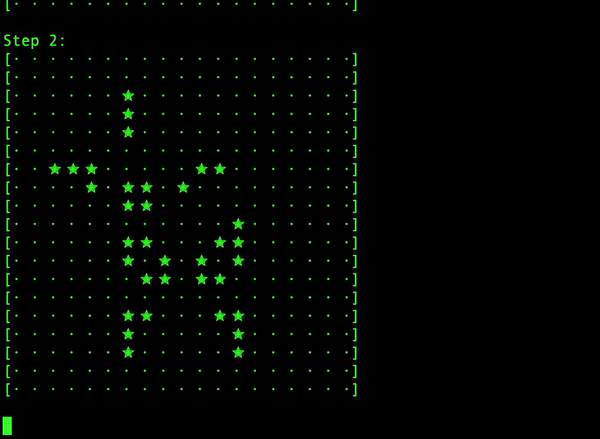
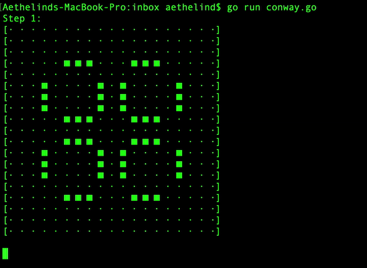

# go-conway
golang implementation of [conway's game of life](https://en.wikipedia.org/wiki/Conway%27s_Game_of_Life) for cmd line!

run with:

```go run conway.go```


### Some random starting position:



### Pulsar:


